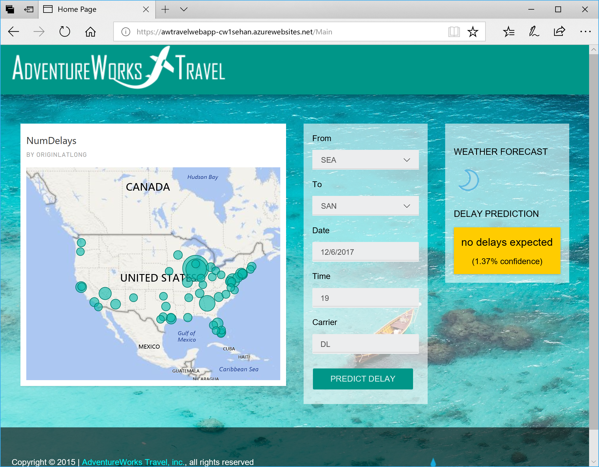
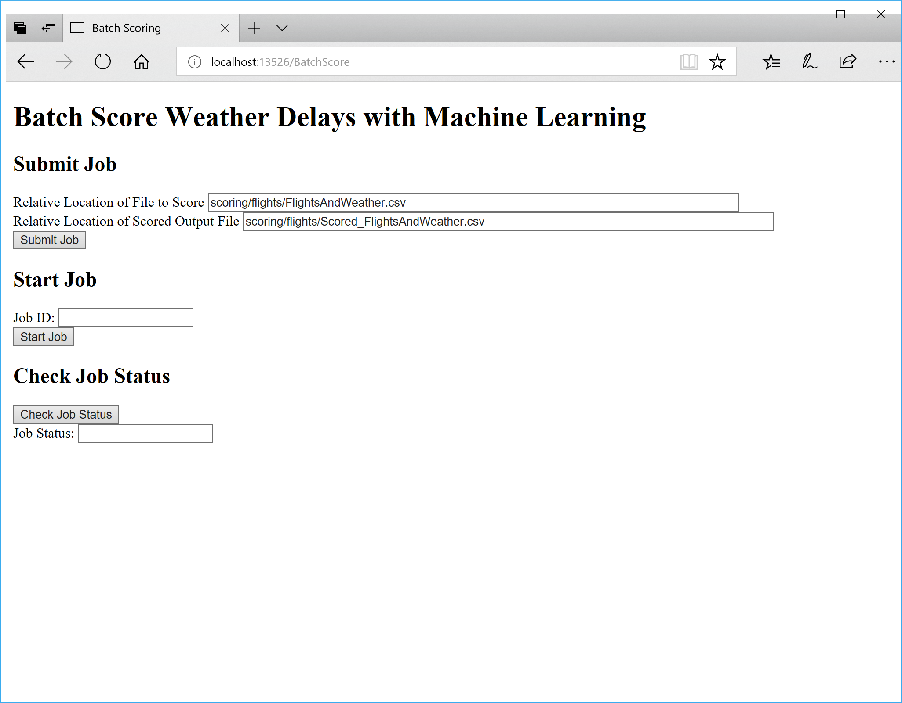
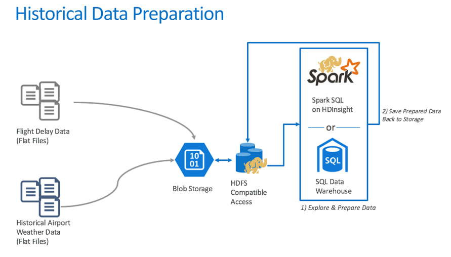
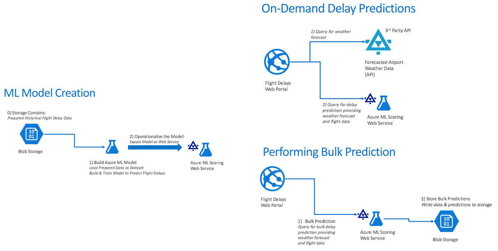
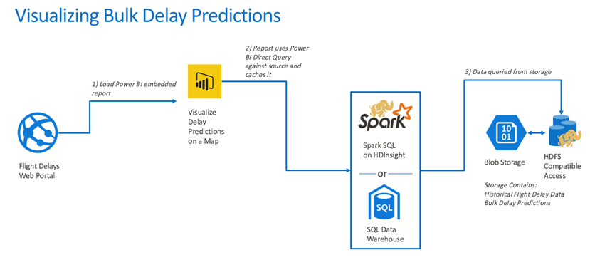

# AdventureWorks Travel - a Cloud Workshop scenario with Azure ML Studio and Power BI
Uses a Power BI integrated Web Application as a basic page. Calls Machine Learning model developed and published with Azure Machine Learning Studio. Calls an external API to retrieve weather information.

- Screenshot

- Solution Architecture

